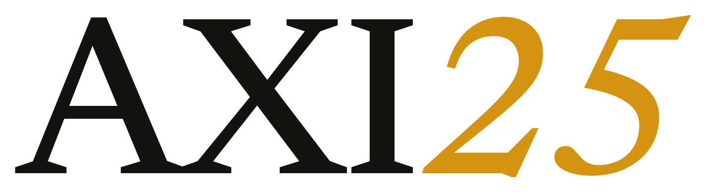

<p align="center">
  <picture>
    <source media="(prefers-color-scheme: dark)" srcset=".assets/axi25-banner-dark.png">
    
  </picture>
</p>

<p align="center"><sub>AXI25 · Augmented eXtraction Intelligence</sub></p>

<p align="center">🇺🇸 English · 🇧🇷 <a href="README.pt-br.md">Português (principal)</a> · 🏠 <a href="README.md">Home</a></p>

Your AI's memory of you. Everything you read, decide, and build goes in, and your AI stops
starting from zero every conversation.

Everyone uses the same AIs. The difference is whether yours knows your whole practice. AXI25 makes
it know: you open a folder in Obsidian and talk to it, and it doesn't just store your notes, it
extracts what matters, connects it, and keeps it ready for your next decision. No server, no new
account, no one more app subscription. Just text files that are yours, on your machine.

## You capture, the AI does the rest

Every notes app turns into a graveyard. You jot something down and never find it again. The boring
part was never the writing, it was the filing afterward: linking one idea to another, updating,
finding it later. Nobody has the patience for that. An AI does.

Here you just talk. "Save this." "What do I know about X?" "How was my week?" The AI sorts it,
connects it, and files it in the right place.

## What it does

- Captures anything in one line. You sort it later, or you don't: the AI sorts it.
- Digests books, articles, and courses into knowledge of your own, in your words, all linked.
- Keeps what you learn in a wiki that gets more useful the more you use it.
- Records the work you do, then mines it for lessons, content ideas, and projects.
- If you work with media, it captures the mood of the moment: what's rising now, before it becomes consensus.

Don't know what a Zettelkasten or a Zeitgeist is? You don't need to. That's a topic for the `docs/`
folder, when (and if) you want it.

## Start in 3 steps

1. Download the latest `axi25-*.zip` from [Releases](https://github.com/felipefontoura/axi25/releases/latest) and unzip it wherever you like.
2. Open it in Obsidian.
3. In the AI panel, say hi.

Saying hi kicks off a guided run of about 10 minutes. It teaches you the system and builds your
vault with you. Nothing here is a template to delete. You build it live. Step by step in
[`SETUP.md`](SETUP.md).

Prefer the terminal? These build the same vault:

```bash
npx @axi25/vault@latest init my-vault
# or
git clone --recurse-submodules https://github.com/felipefontoura/axi25.git my-vault
```

Clone with `--recurse-submodules`: the AI panel plugin is a submodule, and a plain clone leaves it empty.

## What you need

Obsidian, which is free, and a Claude subscription (Pro or Max). The AI panel installs the rest
and guides you on screen. You don't need to know the terminal, apart from pasting one command it
hands you with a copy button.

## The rule that stops the mess

Not every thought becomes knowledge. That's what separates this from one more chaotic notes app.

A raw idea sits in the inbox. It only rises to the wiki when it earns it: when it comes back on
different days, when it changes a decision, when it becomes a word you use all the time. Until
then, it waits. Without that rule you have a swamp. With it you have a brain.

## It's yours, and stays yours

Plain Markdown and folders. Opens in Obsidian, VS Code, vim, any editor. Knowledge is compiled
once and kept current, not rebuilt on every question. You're not locked into anything or anyone.

## It speaks your language

You write in English, it answers in English. Write in Portuguese, it answers in Portuguese. Your
notes come out in your language. So do the file names, or force English if you prefer.

## Advanced

Use Codex, OpenCode, or Pi in the terminal? It runs there too, no extra step. Want to extend,
version, or package it? It's all in the [`docs/`](docs/) folder.

## Running it at work

If you are a developer using AXI25 as the memory of your job, [No-Drift Wiki](https://felipefontoura.com/get/no-drift-wiki/?utm_source=github&utm_medium=referral&utm_campaign=axi25-readme) is the free 30-day playbook I run it with: house rules for meetings and citations, the two scripts in `90-system/scripts/`, and a scorecard.

## Contributing

This repo is the ready-to-use vault. The skills and the agent contract live in
[axi25-core](https://github.com/felipefontoura/axi25-core) (`@axi25/core` on npm), and the Obsidian panel in
[axi25-plugin](https://github.com/felipefontoura/axi25-plugin). Open issues and pull requests where the change belongs.

## License

[MIT](LICENSE). Bundled third-party components keep their own licenses; see
[`THIRD-PARTY-NOTICES.md`](THIRD-PARTY-NOTICES.md).
